# a76probe — a microarchitecture explorer for the Raspberry Pi 5

`a76probe` is a Rust tool that **measures, from user space, microarchitectural parameters of the four
Arm Cortex-A76 cores of the Raspberry Pi 5** (Broadcom BCM2712, up to 2.4 GHz) that public
documentation does not spell out: cache geometry and replacement policy, TLB reach, hardware
prefetchers, branch predictors, out-of-order window sizes, instruction latencies and throughputs,
inter-core cache-line transfer costs.

Every number in a report must come from a raw data file. Every finding carries an explicit
confidence level and is labelled **measured**, **deduced** or **hypothesis**. Results that
contradict the spec or our expectations are documented, not smoothed away — negative and ambiguous
results are results.

> **Status: all six phases are complete** (foundations, memory hierarchy, cache geometry and replacement,
> prefetchers, branch predictors, out-of-order core, inter-core effects). Every result comes with its raw data,
> a confidence level, and the observations that remain unexplained.

## Cortex-A76 on the Raspberry Pi 5 at a glance (all values measured here; confidence in the per-phase sections)

| Area | Parameter | Value |
|---|---|---|
| Caches | L1D | 64 KiB, 4 ways, 256 sets (physical bits 6-13), 64 B lines, tree-PLRU, 4-cycle load-to-use |
| | L2 (per core) | 512 KiB, 8 ways, 1024 sets (bits 6-15), 64 B lines, pseudo-LRU (variant not identified), ≈ 12 cycles |
| | L3 (shared) | 2 MiB, 16 ways, 2048 sets (bits 6-16), victim (exclusive of L2), ≈ 36-38 cycles |
| | DRAM | ≈ 97-98 ns load-to-use; 13.8 GB/s read from one core |
| Translation | 16 KiB pages | L1 D-TLB 48 entries, L2 TLB 1280 entries, +5 cycles for an L2 TLB hit, ≈ 18 cycles page walk |
| Prefetch | strides | ±1 line into L1; up to **21 lines** for the L2/L3 prefetcher; **16 streams**; run-ahead ≈ 40 lines; stops at 16 KiB page boundaries |
| Branches | BTB | 1 cycle up to ≈ 12 branches, 2 cycles up to ≥ 4096; history reach ≈ 2048 taken branches; indirect: 48-63 targets; return stack 16; **mispredict ≈ 15 cycles** |
| Core | Out-of-order window | ROB **128**, ≈ 87 integer / ≈ 96 vector destinations in flight, load queue ≈ 36, store buffer ≈ 42, ≈ 9 outstanding L1 misses |
| | Execution | 3 integer ALUs, 64-bit `mul` 1 per 3 cycles, 2 NEON FMA per cycle (≈ 38 Gflop/s SP peak), 2 loads per cycle |
| Multicore | Line transfer | ≈ 70 ns (≈ 168 cycles) between cores; store forwarding 5.5 cycles |

## Why this is harder than it looks

Timing a loop on a modern out-of-order CPU is easy. Trusting the number is not. `a76probe` therefore
treats the *measurement chain itself* as an object under test:

- **Two independent clocks** (the generic timer `CNTVCT_EL0` and the PMU cycle counter), whose cost,
  resolution and jitter are measured, and which are cross-checked against each other and against
  the reported CPU frequency.
- **PMU cross-validation.** Whenever a relevant hardware event exists, timing results are confirmed
  with performance counters (`perf_event_open`, user-space only). The report says *who confirmed what*.
- **Compiler control.** Critical loops are hand-written with `core::arch::asm!`; their
  disassembly is archived in [`docs/asm/`](docs/asm/kernels.txt) and checked against the intended
  instruction counts.
- **Environment guard.** Before and after every repetition the tool reads the temperature and the
  effective CPU frequency. Runs are paused above 75 °C, aborted above 80 °C, and any repetition
  whose frequency drifted is flagged invalid and excluded from the statistics.
- **Statistics, not anecdotes.** ≥ 30 repetitions per measurement, warm-up, pinned core, prefaulted
  and locked memory, median + MAD + percentiles + bootstrap 95 % confidence interval.

## Phase 0 results (measured on a Raspberry Pi 5, 8 GB)

Measured with `a76probe selftest --core 1 --repeat 30`: 2460 repetitions, **0 flagged invalid**,
temperature 52–59 °C, frequency pinned at 2.4 GHz throughout. Raw data:
[`results/2026-09-19/raw/selftest.jsonl`](results/2026-09-19/raw/selftest.jsonl).

| What | Result (median) | Note |
|---|---|---|
| `CNTFRQ_EL0` | 54 MHz (18.5 ns per tick) | read with `mrs` |
| `CNTVCT_EL0` read cost (with `isb`) | 21.68 ns ≈ 52 cycles | 95 % CI [21.678, 21.680] ns |
| `CNTVCT_EL0` back-to-back delta | min 1 tick, p99 2 ticks, max ≈ 49 ticks | rare ≈ 0.9 µs outliers |
| PMU cycle counter `read()` cost | 396 ns (p99 426 ns) | `perf_user_access=0`, so a syscall is required |
| PMU window (`reset`+`enable`+`disable`) | 1.40 µs | fixed cost per measured region |
| `INST_RETIRED` vs. instruction count of a known loop | ratio 1.000001 | 10 and 12 instructions per iteration |
| PMU cycles vs. frequency × time | 0.9994 / 0.9995 | effective frequency 2.3986 GHz |
| Dependent `add` chain | 10.000 cycles per 10 chained adds | ⇒ 1-cycle `add` latency (deduced) |
| Independent `add` loop | 3.000 cycles per iteration, IPC 3.33 | 9 ALU ops + 1 branch per 3 cycles |
| PMU counters in one group without multiplexing | 7 (incl. `cpu_cycles`) | probed by opening groups of growing size |

Per-event validation (25 events × 3 workloads whose event counts are derivable from the code) also
turned up a few things worth investigating in later phases, all from the same data file:

- `L1D_TLB_REFILL` ≈ 8199 for a 64 MiB stream traversed twice = **one refill per 16 KiB page**
  (4096 pages × 2), independently confirming the 16 KiB kernel page size.
- `BUS_ACCESS` ≈ 8.0 per 64-byte line streamed from DRAM.
- `L2D_CACHE_WB` ≈ 1 per streamed line although the stream only *reads* — **hypothesis:** clean L2
  evictions are counted as write-backs because the L3 acts as a victim cache. To be tested in Phase 2.
- `L2D_CACHE_REFILL` (1.35 M) is much lower than `L1D_CACHE_REFILL` (2.09 M) on a sequential stream,
  while `L3D_CACHE_REFILL` stays near one per line — **hypothesis:** prefetch-triggered L2 fills are not
  counted as refills. To be tested in Phase 3.

Full table with confidence levels and source files: [`RESULTS.md`](RESULTS.md) (in French).

## Phase 1 results: memory hierarchy (Raspberry Pi 5, 2.4 GHz, `performance` governor)

30 repetitions per point in 3 order-alternating rounds, 9900 repetitions in total, **0 flagged invalid**.
Raw data: [`raw/mem_lat.jsonl`](results/2026-09-19/raw/mem_lat.jsonl),
[`raw/tlb_lat.jsonl`](results/2026-09-19/raw/tlb_lat.jsonl), [`raw/mem_bw.jsonl`](results/2026-09-19/raw/mem_bw.jsonl);
curves: [`mem_latency.csv`](results/2026-09-19/mem_latency.csv), [`tlb_latency.csv`](results/2026-09-19/tlb_latency.csv),
[`mem_bandwidth.csv`](results/2026-09-19/mem_bandwidth.csv).


| Level | Latency (measured) | Capacity check against sysfs |
|---|---|---|
| L1D | **4.00 cycles** (1.667 ns) | miss onset between 64 and 72.75 KiB: compatible with 64 KiB |
| L2 | **11.6–11.9 cycles** (≈ 4.9 ns) | smooth ramp from ≈ 0.4 to 1 MiB: compatible with 512 KiB, not sharper |
| L3 | **36–38 cycles** (15–16 ns, includes some L1-TLB misses) | miss onset at ≈ 1.6 MiB, 55 % misses at 4 MiB: compatible with 2 MiB |
| DRAM | **≈ 97–98 ns** (≈ 233 cycles) without page walks; **119.7 ns** at 1 GiB with walks | — |

Random pointer chasing shows exactly one L1D refill per load beyond L1, i.e. **no exploitable prefetching**
on this access pattern (confirmed by `L1D_CACHE_REFILL`).


| TLB (16 KiB pages, no hugepages available) | Result |
|---|---|
| L1 data TLB | **48 entries** (0 misses at 48 pages, 100 % at 52): reach 768 KiB |
| L1 → L2 TLB penalty | **+5.0 cycles** (2.085 ns) |
| L2 TLB | **1280 entries** (≈ 0 walks at 1280 pages, 15 % at 1344): reach 20 MiB |
| Page-walk cost | ≈ **7.6 ns** (≈ 18 cycles) with cache-resident page tables, growing with the span |


| NEON traffic (read + write), decimal GB/s | 1 core | 4 cores |
|---|---|---|
| Read, 16 KiB (L1) | **75.3** (31.4 B/cycle) | 300.9 |
| Read, L2-resident | 44.2 | 173–176 |
| Read, DRAM | **13.8** | 12.4 |
| Write, 16 KiB – 1 MiB | 38.3 (flat, 16 B/cycle) | see `RESULTS.md` |
| Write, DRAM | 9.0 | 9.3 |
| Copy, DRAM | 8.8 | 7.2 |

Surprises kept in the record, with hypotheses and no smoothing: **aggregate DRAM read bandwidth
decreases as cores are added**; single-core writes stay at 16 B/cycle up to 1 MiB with almost no refills
(hypothesis: full-line stores skip the read-for-ownership); multi-core writes with private working sets that
fit in L2 collapse (hypothesis: they go through a shared level); reading a 16 KiB set is 27 % faster than
a 32 KiB set for reasons not yet explained. See [`RESULTS.md`](RESULTS.md).

## Phase 2 results: cache geometry and replacement policy

Two independent full runs (4800 repetitions each, 30 per point, 0 flagged invalid). Physical addresses come from
`/proc/self/pagemap` read as root (read-only, own mapping; the pool is `mlock`ed and no page moved during the runs).
Lines are chosen so that chosen physical address bits are equal (same set) or differ in exactly one bit (index-bit test).
Raw data: [`raw/cache_run1.jsonl`](results/2026-09-19/raw/cache_run1.jsonl),
[`raw/cache_run2.jsonl`](results/2026-09-19/raw/cache_run2.jsonl); tables:
[`cache_experiments_run2.csv`](results/2026-09-19/cache_experiments_run2.csv).

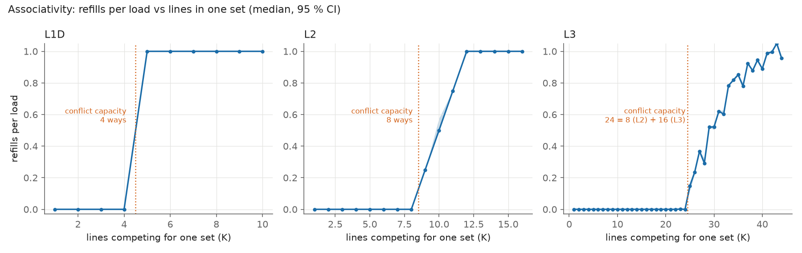

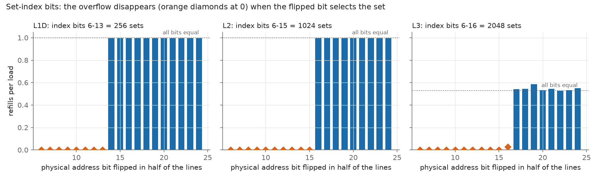

| Level | Size | Ways | Sets | Line | Replacement candidate | Confidence |
|---|---|---|---|---|---|---|
| L1D | 64 KiB (measured: 4 × 256 × 64 B) | **4** (sharp: 0 misses at 4 lines, 100 % at 5) | **256**, index = physical bits 6–13 | **64 B** | **tree-PLRU** (strict LRU ruled out) | medium |
| L2 | 512 KiB (measured: 8 × 1024 × 64 B) | **8** (ramp 25/50/75/100 % at 9–12 lines) | **1024**, index = bits 6–15 | **64 B** | pseudo-LRU family, variant **not identified** | low |
| L3 | 2 MiB (deduced: 16 ways × 2048 × 64 B) | conflict capacity **24 = 8 (L2) + 16 (L3)** | **2048**, index = bits 6–16 | 64 B (assumed) | not characterised | medium (geometry) |

- The set-index bits are **contiguous** at every level, and flipping any of the bits 17–24 does not relieve the L3,
  so no hash involving those bits is observed. sysfs geometry is confirmed by measurement for L1D and L2.
- A conflict capacity of **24 = 8 + 16** at the L3 means the L3 does **not** duplicate what the L2 holds: it behaves
  as a **victim (exclusive) cache**. An inclusive L3 would give 16. This agrees with Phase 1 (effective L3 capacity
  ≈ 1.9 MiB) and with the Phase 0 write-back counter observation.

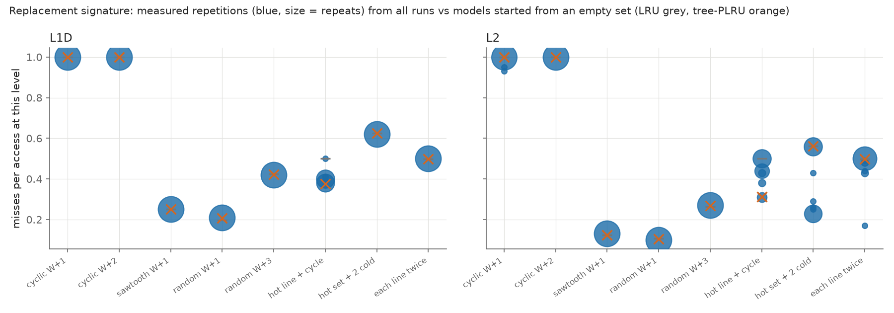

Replacement is identified by replaying eight access patterns over W+1…W+3 lines of one set, and comparing the measured
steady-state miss rates with eight software models (LRU, tree-PLRU, FIFO, random, SRRIP, BRRIP, NRU, SRRIP-FP), each
started from many random initial states.

- **L1D**: cyclic, sawtooth, random and reuse patterns all match tree-PLRU; the "one hot line + cycle" pattern gives
  0.38–0.40 misses per access against 0.375 for tree-PLRU and 0.50 for LRU. Mean distance to the model: PLRU 0.002–0.004,
  LRU 0.016–0.017.
- **L2**: patterns without reuse match the LRU/PLRU/NRU family and rule out random and RRIP models, but patterns with
  reuse settle into **several discrete steady states that change between repetitions and between runs**
  (e.g. "one hot line + cycle": 0.31, 0.38, 0.44 or 0.50; "hot set + 2 cold": 0.56 in 24/30 repetitions of run 1,
  0.23 in 22/30 of run 2). The best model differs by run (tree-PLRU, then NRU). A tree-PLRU started from a partly
  invalid set reproduces exactly the 0.315 / 0.375 / 0.44 / 0.50 states in simulation (hypothesis: a pseudo-LRU whose
  limit cycle depends on the initial way layout); the 0.23 state is reproduced by no model.
- **L1/L2 inclusion**: the test is **ambiguous** (0.20–0.21 L2 refills per access; a PLRU L2 without back-invalidation
  predicts 0, with back-invalidation 1).

`a76probe analyze-cache --raw <file>` re-scores the replacement signatures from the raw data without touching hardware.

## Phase 3 results: hardware prefetchers

One full run (9660 repetitions, 30 per point, 0 flagged invalid). No prefetcher-specific PMU event is exposed, so everything
is inferred from (a) the latency of dependent loads along a constant stride compared with a random order over the same set, and
(b) how many lines are actually read on the bus (`BUS_ACCESS` / 8) by cold streams of `n` lines. Raw data:
[`raw/prefetch.jsonl`](results/2026-09-19/raw/prefetch.jsonl); table:
[`prefetch_experiments.csv`](results/2026-09-19/prefetch_experiments.csv).

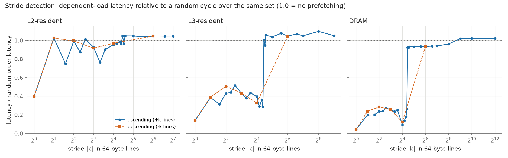

| Finding | Value | Confidence |
|---|---|---|
| Largest tracked stride | **21 lines (1344 B)** forward; 22 lines is no longer followed (DRAM ratio 0.26 → 0.92, L3 0.29 → 1.00) | high |
| Two mechanisms, told apart by working-set size | data in L2: only **±1 line** speeds up (1.9 ns ≈ 4.5 cycles, the L1 latency); data in L3 or DRAM: strides **±1…21** all speed up (0.14–0.52 of random in L3, 0.04–0.27 in DRAM) | medium |
| Latency reached | ±1 in DRAM: 4.6 ns (≈ 11 cycles, the L2 latency) instead of 110 ns | high |
| Streams tracked at once | **16** interleaved sequential streams; 17 already collapses (9 ns → 30 ns per access) | high |
| Training length | prefetching starts at the **4th** sequential access (stride 16: only after 17–24) | medium |
| Run-ahead | **≈ 40 lines** (2.5 KiB) for a sequential stream once it is long enough (n ≥ 48), **≈ 15–16 lines** for strided streams | medium |
| Descending streams | behave like ascending ones (same trigger, same 40-line run-ahead) | medium |

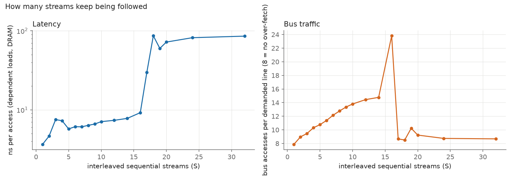

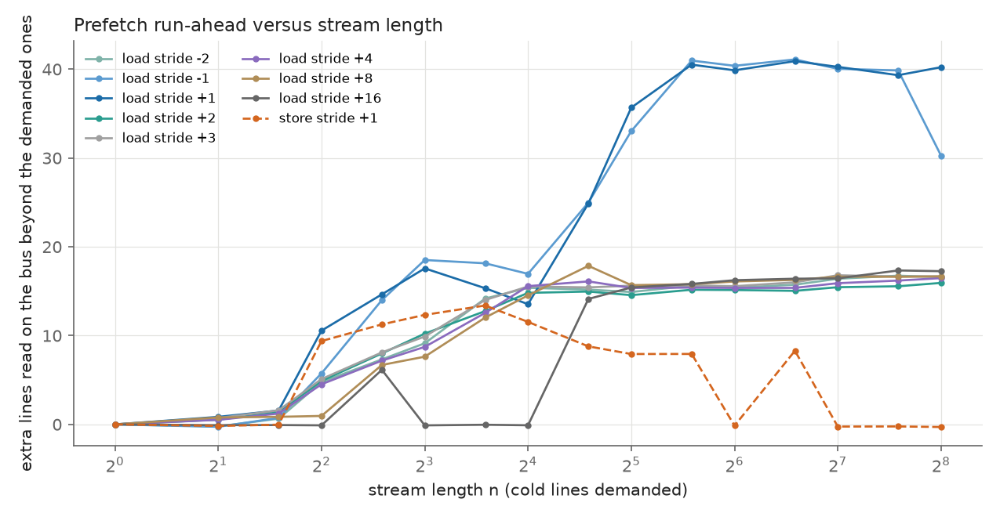

Boundaries (16-line cold streams; the physically contiguous case uses 32 MiB from the CMA DMA heap):

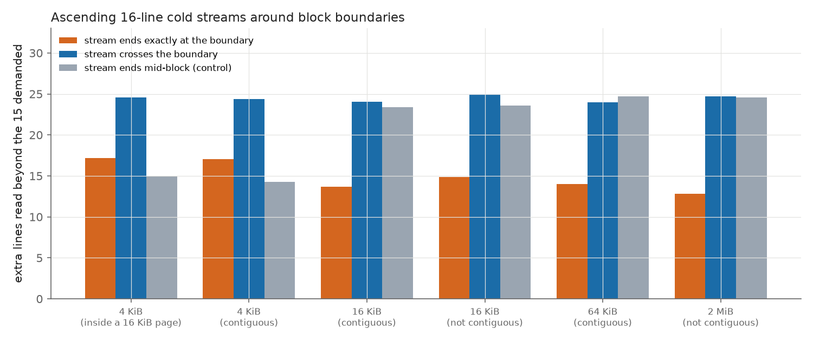

- **The prefetcher does not run across a 16 KiB page boundary** (the translation granule): a stream that ends exactly on the boundary
  reads about 10 fewer lines than the control, both in ordinary and in physically contiguous memory; it **does** continue when the
  demand itself crosses the boundary. It does **not** stop at 4 KiB boundaries inside a page. No extra limit shows up at 64 KiB or 2 MiB.
- **Stores** follow a next-line pattern too: +1/−1 stride stores take 0.65 of the random-order time, and the benefit fades smoothly with
  stride (no cut at 21 as for loads); their run-ahead is shorter (≈ 8 lines versus ≈ 40).
- Kept in the record without smoothing: non-monotonic partial gains at strides 3, 5, 10 with data in L2; an unusually good stride of 16
  lines in DRAM; a reproducible dip at n = 16 for +1 streams; store streams whose run-ahead vanishes at n = 64, 128, 192, 256 but not at 96.

## Phase 4 results: branch predictors

The test code is **generated at run time** (`mmap` RW, write, `dc cvau` / `ic ivau` cache maintenance, `mprotect` R+X, never W+X), by a small assembler
with unit-tested encoders and a functional self-test of every generated function before any measurement. One full run: 14 670 repetitions, 30 per point,
0 flagged invalid. Raw data: [`raw/branch.jsonl`](results/2026-09-19/raw/branch.jsonl); table:
[`branch_experiments.csv`](results/2026-09-19/branch_experiments.csv).

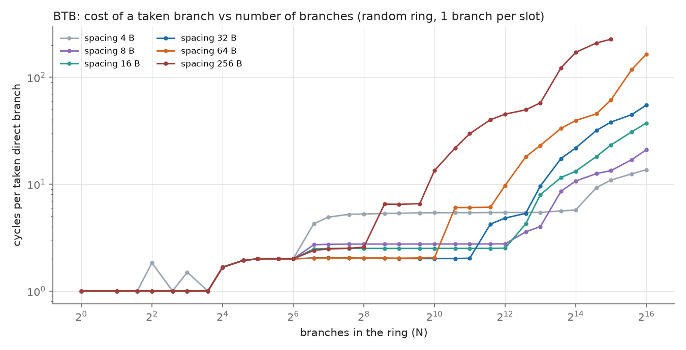

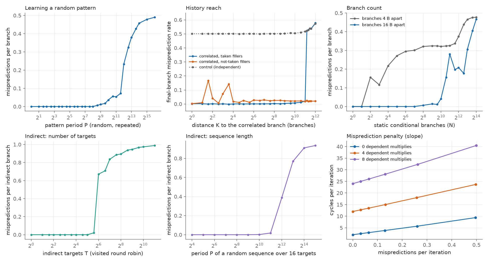

| Predictor | Measured result | Confidence |
|---|---|---|
| Taken-branch cost (BTB) | **1 cycle** per taken branch up to ≈ 12 branches, 1.67 at 16, **2 cycles** from 32 branches up to ≥ 1024–4096 branches | high |
| BTB capacity | first level between **12 and 16** branches; second level **≥ 4096** taken branches (bounded from below only: the 64 KiB instruction cache takes over) | medium / lower bound |
| Conditional predictor, random pattern | learned exactly up to a period of **256** positions, > 90 % up to ≈ 3000, collapses at ≥ 4096 | high |
| History reach | a branch correlated with one **2048** taken branches earlier is still predicted (rate ≤ 0.02); at 2304 it is not (0.52 = the independent control) | medium |
| Not-taken branches | they do **not** consume history (correlation survives 6144 not-taken fillers) | medium |
| Distinct conditional branches | ≈ **1000** static branches predicted almost perfectly (period-2/4/8 outcomes); degrades from 1024 to 1536 | medium |
| Indirect predictor | **48–63 targets** visited in a fixed cycle (0 mispredictions up to 32, 0.02 at 48, 0.67 at 64); a random sequence over 16 targets is learned up to a period of ≈ 1024–2048 | high |
| Return stack | **16 entries** (extra mispredictions only appear from call depth 18, +0.5 per extra level) | high |
| Misprediction penalty | **≈ 15 cycles** (14.81 [14.74, 14.86]) when the branch resolves early; +2.2 cycles per dependent multiply that delays its resolution | high |

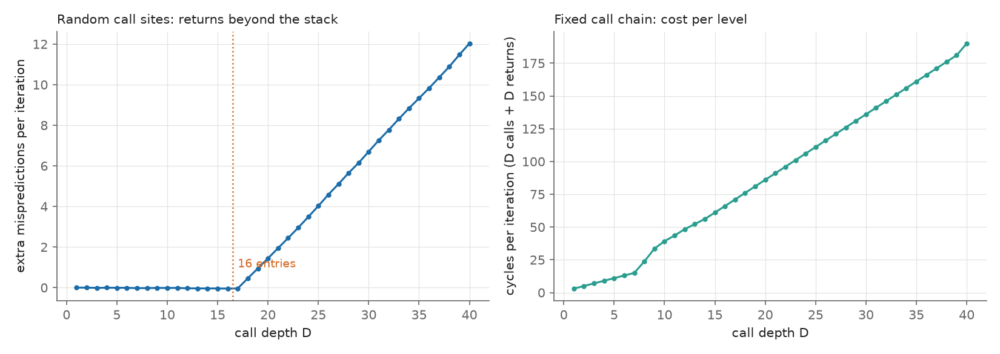

Kept in the record: adjacent branches (4 bytes apart) produce artefacts in several tests (they are reported as such, not as capacities); a fixed call chain costs
2 cycles per level up to depth 7, then ≈ 5 cycles per level, with no misprediction, for a reason not identified; the history reach of 2048 taken branches is an
observation whose micro-architectural meaning (register length versus another mechanism) is not established.

## Phase 5 results: the out-of-order core

One full run (15 960 repetitions, 30 per point, 0 flagged invalid). Raw data: [`raw/ooo.jsonl`](results/2026-09-19/raw/ooo.jsonl); table:
[`ooo_experiments.csv`](results/2026-09-19/ooo_experiments.csv). Window sizes come from a generated loop with **one independent DRAM miss per iteration followed by
N independent filler instructions**: the time per iteration jumps whenever one more iteration stops fitting in the limiting resource, so the jump positions (several
per resource, all consistent with a single capacity) give its size.

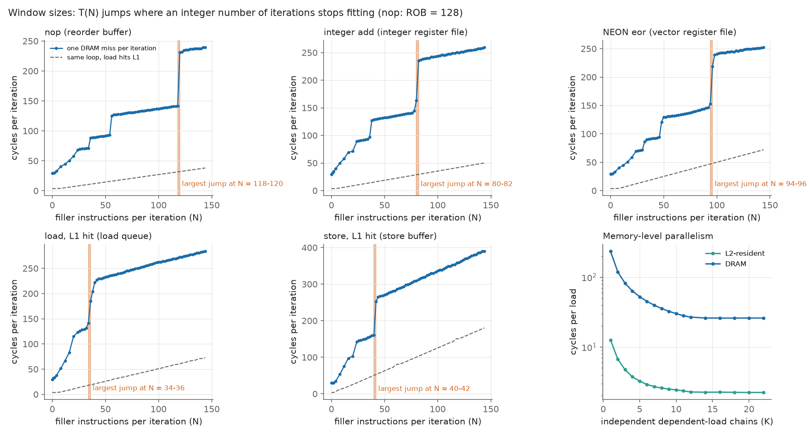

| Resource | Measured size | Confidence |
|---|---|---|
| Reorder buffer | **128 instructions** (jumps at N = 118-120, 54-56, 34-36, 20-24, ... match 128/k - 8 for every k) | high |
| Integer registers | ≈ **87** integer destinations in flight (≈ 118-120 physical registers if 31 are architectural) | medium (physical count: low) |
| Vector registers | ≈ **96** vector destinations in flight (≈ 128 physical registers if 32 are architectural) | medium (physical count: low) |
| Load queue | ≈ **36** loads in flight (36-42) | medium-low |
| Store buffer | ≈ **42** stores in flight (41-43) | medium |
| L1 miss parallelism (MLP) | ≈ **9** outstanding L1 misses (DRAM latency 235 cycles = 98 ns; saturates at 26 cycles per load) | medium |

Instruction latency and reciprocal throughput (cycles, INST_RETIRED confirms the loop content):

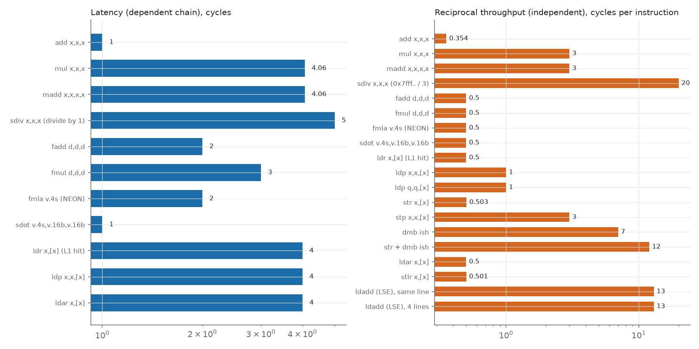

- **Integer**: `add` 1 / 0.354 (3.0 ALU operations per cycle including the loop counter, so 3 integer ALUs), 64-bit `mul` and `madd` latency 4 but only one per **3 cycles**, `sdiv` 5 (divide by 1) and
  20 cycles per operation for a large dividend.
- **FP / NEON**: `fadd` 2, `fmul` 3, `fmla v.4s` 2 and `sdot` 1 on the accumulator chain, all at **2 per cycle**: about 16 single-precision flops per cycle per core (≈ 38 Gflop/s peak at 2.4 GHz, deduced).
- **Memory**: `ldr` latency 4, 2 loads per cycle; `ldp x` and `ldp q` 1 per cycle (32 B/cycle from L1); `ldar` and `stlr` cost the same as `ldr` and `str`;
  `dmb ish` 7 cycles alone (12 per `str` + `dmb` pair); LSE `ldadd` 13 cycles per atomic, not pipelined.
- Unexplained and kept in the record: `stp x,x` at 3 cycles per instruction, a load-queue ramp of jumps between N = 36 and 42, and the DRAM MLP plateau that may be a random-access throughput limit rather than a buffer size.

Two measurement traps found and fixed during development are documented in [`docs/methodology.md`](docs/methodology.md) (a replayed random sequence that hit in cache, and a load whose unused
result did not block retirement).

## Phase 6 results: inter-core effects and access corner cases

One full run (5070 repetitions, 30 per point, 0 flagged invalid). Raw data: [`raw/multicore.jsonl`](results/2026-09-19/raw/multicore.jsonl); table:
[`multicore_experiments.csv`](results/2026-09-19/multicore_experiments.csv).

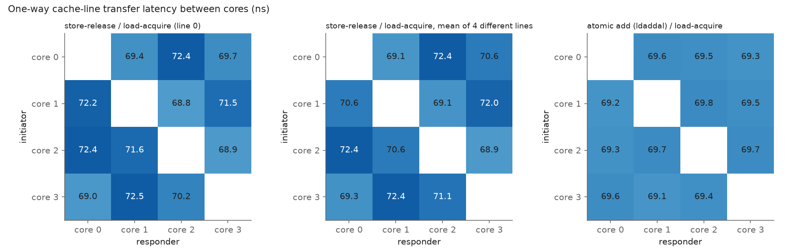

| Measurement | Result | Confidence |
|---|---|---|
| Cache-line transfer between two cores (store-release / load-acquire ping-pong) | **≈ 70 ns one way (≈ 168 cycles)**: 68.5-70.6 ns between neighbouring cores (0-1, 1-2, 2-3, 3-0), **72.0-72.5 ns between opposite cores** (0-2, 1-3); same pattern on four different lines | high (values) / medium (pair dependence) |
| Same with an atomic add (`ldaddal`) | **69.1-69.8 ns**, no dependence on the pair of cores | high |
| Store-to-load forwarding | **5.5 cycles** for most size/offset combinations (a plain L1 load is 4); **10.5 cycles** (slow path) for a byte or half-word taken at a non-zero offset inside a stored 8-byte word and for a byte store followed by a wide load; 7-8.5 cycles across a 64-byte line, **14.5-15.8 cycles** across a 16 KiB page | high |
| Unaligned loads | practically **free** (1.0 cycle, 1 L1D access, even across a line; ≤ 1.7 cycles at a 4 KiB boundary) | medium |
| Unaligned stores | **1 to 4 cycles** depending on the offset (worst at offsets 9, 15, 57, 63); **≈ 11 cycles and two L1D accesses** when a store crosses a 4 KiB or 16 KiB boundary | medium |

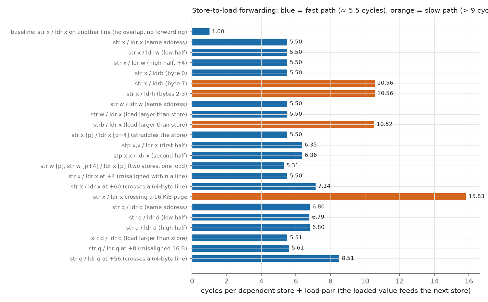

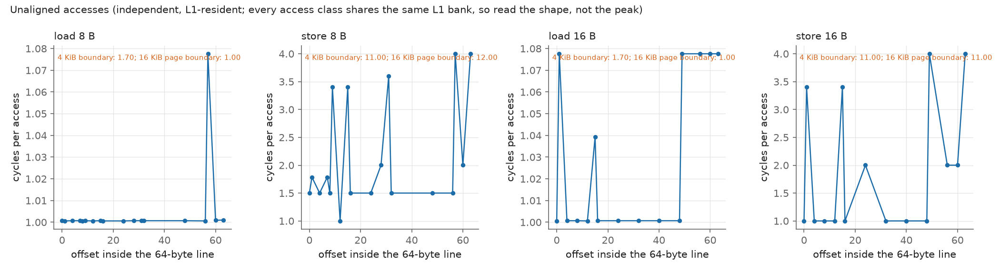

Kept in the record: a load wider than the store, or overlapping it by half, does **not** show a forwarding failure here (a merge with L1 data cannot be told apart from partial forwarding by a timing
test); a 4 KiB boundary costs a load 1.7 cycles while a 16 KiB page boundary (which is also a 4 KiB boundary) costs 1.0, unexplained; the first version of the boundary test measured L1 conflict
misses because eight boundaries 16 KiB apart share the same L1 sets, and was replaced by two distinct boundaries.

## Roadmap

| Phase | Topic | Status |
|---|---|---|
| 0 | Foundations: env snapshot, timing sources, PMU wrapper, stats, guard, JSONL output, self-test | **done** |
| 1 | Memory hierarchy: pointer-chasing latency, TLB reach, NEON bandwidth (1–4 cores) | **done** |
| 2 | Cache geometry and replacement policy (compared with software LRU/PLRU/FIFO/random/SRRIP/NRU models) | **done** |
| 3 | Hardware prefetchers: stride range, streams, distance, page-boundary behaviour | **done** |
| 4 | Branch predictors via runtime-generated code: BTB, history length, indirect, return stack, penalty | **done** |
| 5 | Out-of-order core: ROB / load queue / store buffer / register files, MLP, instruction latency and throughput | **done** |
| 6 | Inter-core: 4×4 line-transfer latency, store-to-load forwarding, unaligned access costs | **done** |

Each phase ends with a summary of results, surprises, limits and remaining uncertainties, and waits
for review before the next one starts.

## Getting started

### Requirements

- A Raspberry Pi 5 running a 64-bit OS (developed on Debian 13, kernel 6.18, 16 KiB pages).
- A build host with **stable Rust** (developed with 1.95) and the extra target:
  `rustup target add aarch64-unknown-linux-musl`. Cross-compilation uses the `rust-lld` linker that
  ships with Rust and produces a **static** binary, so nothing needs to be installed on the Pi.
- For `deploy.sh`: PuTTY's `plink` and `pscp` on the build host (Windows), or adapt the script to `ssh`/`scp`.

### Build

```sh
cargo build --release        # target and flags come from .cargo/config.toml
                             # (aarch64-unknown-linux-musl, -C target-cpu=cortex-a76)
```

Unit tests of the portable modules run on the build host, the rest on the Pi:

```sh
cargo test --lib --target x86_64-pc-windows-msvc   # or your host triple
```

### Run

Copy `target/aarch64-unknown-linux-musl/release/a76probe` to the Pi, or use the helper, which builds,
copies, runs and fetches results (the password is never stored in the repository):

```sh
export A76_PI_HOST=<pi address> A76_PI_PASS=<password>   # A76_PI_USER defaults to "hugues"
./deploy.sh env                                  # environment snapshot (JSON)
./deploy.sh selftest --core 1 --repeat 30        # validate the measurement chain
./deploy.sh run --all --core 1 --repeat 30       # phase 1 experiments (about 25 minutes)
# phase 2 needs root for /proc/self/pagemap: run it on the Pi with sudo (see below)
```

On the Pi directly:

```sh
./a76probe env [--out env.json]      # kernel, page size, caches, MIDR, governor, temperature, PMU, ...
./a76probe selftest --core 1 --repeat 30 --out-dir results
./a76probe run --all --core 1 --repeat 30            # or --exp latency | tlb | bandwidth
sudo ./a76probe run --exp cache --core 1 --repeat 30   # phase 2 (about 12 minutes; root only for pagemap)
./a76probe run --exp prefetch --core 1 --repeat 30      # phase 3 (about 20 minutes; run as root to also classify boundaries)
./a76probe run --exp branch --core 1 --repeat 30        # phase 4 (about 15 minutes; no root needed)
./a76probe run --exp ooo --core 1 --repeat 30           # phase 5 (about 12 minutes; no root needed)
./a76probe run --exp multicore --core 1 --repeat 30     # phase 6 (about 6 minutes; uses all four cores)
./a76probe analyze-cache --raw results/<date>/raw/cache.jsonl   # re-score replacement policies offline
./a76probe pmu-list                  # PMU events exposed by the kernel
```

`selftest` writes `results/<date>/env.json` and `results/<date>/raw/selftest.jsonl` (one JSON line
per repetition and per summary) and prints a summary table.

No `sudo` is required for phases 0 and 1: performance counters are opened with `exclude_kernel` on the
tool's own process, which the default `perf_event_paranoid=2` allows. For steadier frequency during the
long sweeps, the phase 1 data was taken with the `performance` governor
(`echo performance | sudo tee /sys/devices/system/cpu/cpu*/cpufreq/scaling_governor`; revert with `ondemand`);
under `ondemand` the CPU also stayed at 2.4 GHz during busy runs, and the frequency guard would flag any drift.

## Repository layout

```
src/
  main.rs        CLI (clap): env | selftest | run | analyze-cache | pmu-list
  env.rs         environment snapshot (sysfs, MIDR, cpufreq, PMU, hugepages, ...); MAC addresses redacted
  timing.rs      CNTVCT_EL0 / CNTFRQ_EL0 access
  pmu.rs         perf_event_open wrapper: event discovery from sysfs, groups, exclude_kernel
  kernels.rs     critical loops in inline asm (instruction count per iteration documented)
  harness.rs     warm-up, guarded repetitions, validity flags, summaries
  guard.rs       temperature / frequency guard
  stats.rs       median, MAD, percentiles, bootstrap CI, deterministic PRNG
  output.rs      JSON Lines writer, UTC date helper
  affinity.rs    sched_setaffinity + verification
  mem.rs         mmap + MAP_POPULATE + mlock buffers
  selftest.rs    the self-test itself
  mem_lat.rs     phase 1: pointer-chasing latency and TLB experiments
  mem_bw.rs      phase 1: NEON read/write/copy bandwidth, 1-4 cores
  perm.rs        single-cycle (Sattolo) permutations
  phys.rs        pagemap reader (physical addresses of our own pages, root only)
  lineset.rs     selection of lines with prescribed physical-address bits
  cache_geom.rs  phase 2: line size, associativity, index bits, replacement, inclusion
  a64.rs         AArch64 instruction encoders and a label-resolving assembler (unit-tested)
  jit.rs         executable buffers: mmap RW, cache maintenance, mprotect R+X
  branch.rs      phase 4: BTB, history, capacity, indirect, return stack, misprediction penalty
  multicore.rs   phase 6: cross-core ping-pong, store-to-load forwarding, unaligned accesses
  ooo.rs         phase 5: window sizes (ROB, register files, load/store queues), MLP, instruction latency/throughput
  prefetch.rs    phase 3: stride sweep, interleaved streams, run-ahead, boundaries, stores
  sim.rs         software models of one cache set (LRU, tree-PLRU, FIFO, random, SRRIP, BRRIP, NRU, SRRIP-FP)
  analysis.rs    offline scoring of measured replacement signatures against the models
docs/
  methodology.md per-experiment hypothesis, principle, possible biases (French)
  asm/           archived objdump output of the asm kernels
scripts/        plot.py (phase 1), plot_cache.py (phase 2), plot_prefetch.py (phase 3), plot_branch.py (phase 4), plot_ooo.py (phase 5) and plot_multicore.py (phase 6) draw the figures from the CSV/JSONL files (matplotlib)
results/<date>/  env.json, CSV curves and raw/*.jsonl produced on the Pi
PLAN.md          architecture, technical decisions, risks, open questions (French)
RESULTS.md       every finding: value, method, confidence, source file (French)
deploy.sh        build + copy + run + fetch helper
```

## Scope and safety

In scope: characterising **your own** processes and **your own** memory.
Out of scope: Spectre/Meltdown exploits or proofs of concept, Prime+Probe against other processes,
kernel modules, data exfiltration. The tool changes no system setting; anything that would (governor,
`perf_event_paranoid`, `perf_user_access`, hugepages) is documented with the exact command and how to
revert it, and left to the user.

## Findings about this particular Pi (kernel 6.18, Raspberry Pi OS / Debian 13)

- 16 KiB pages; **no hugepages and no transparent hugepages** are exposed (`/sys/kernel/mm/hugepages`
  and `transparent_hugepage` are absent). Experiments that would normally use hugepages need another
  approach, described in [`PLAN.md`](PLAN.md).
- The PMU device is named `armv8_cortex_a76` (not `armv8_pmuv3_*`), exposes ~40 events, and
  `perf_user_access=0` means cycle counts are read with a syscall rather than directly from user space.
- sysfs reports L1D/L1I 64 KiB 4-way, L2 512 KiB 8-way (per core), L3 2 MiB 16-way (shared). These
  values are treated as **hypotheses** until Phase 2 confirms them experimentally.

## License

Licensed under the [Apache License, Version 2.0](LICENSE).
