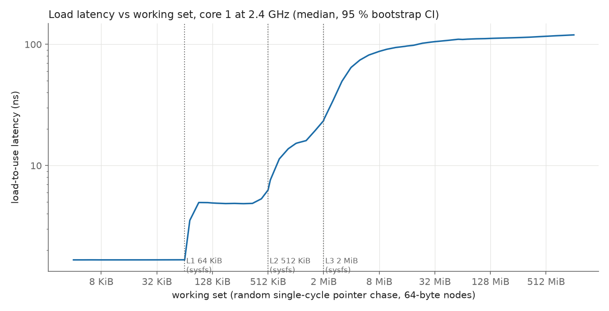
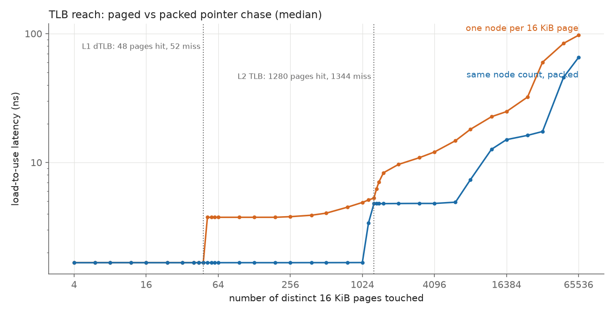
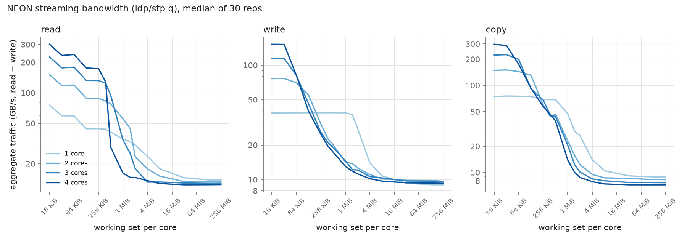

# a76probe — a microarchitecture explorer for the Raspberry Pi 5

`a76probe` is a Rust tool that **measures, from user space, microarchitectural parameters of the four
Arm Cortex-A76 cores of the Raspberry Pi 5** (Broadcom BCM2712, up to 2.4 GHz) that public
documentation does not spell out: cache geometry and replacement policy, TLB reach, hardware
prefetchers, branch predictors, out-of-order window sizes, instruction latencies and throughputs,
inter-core cache-line transfer costs.

Every number in a report must come from a raw data file. Every finding carries an explicit
confidence level and is labelled **measured**, **deduced** or **hypothesis**. Results that
contradict the spec or our expectations are documented, not smoothed away — negative and ambiguous
results are results.

> **Status: Phases 0 (foundations) and 1 (memory hierarchy) are complete.** The measurement chain is
> validated on real hardware and the first experiments have produced curves for cache/DRAM latency,
> TLB reach and NEON bandwidth. Phases 2–6 are not written yet; see the [roadmap](#roadmap).

## Why this is harder than it looks

Timing a loop on a modern out-of-order CPU is easy. Trusting the number is not. `a76probe` therefore
treats the *measurement chain itself* as an object under test:

- **Two independent clocks** (the generic timer `CNTVCT_EL0` and the PMU cycle counter), whose cost,
  resolution and jitter are measured, and which are cross-checked against each other and against
  the reported CPU frequency.
- **PMU cross-validation.** Whenever a relevant hardware event exists, timing results are confirmed
  with performance counters (`perf_event_open`, user-space only). The report says *who confirmed what*.
- **Compiler control.** Critical loops are hand-written with `core::arch::asm!`; their
  disassembly is archived in [`docs/asm/`](docs/asm/kernels.txt) and checked against the intended
  instruction counts.
- **Environment guard.** Before and after every repetition the tool reads the temperature and the
  effective CPU frequency. Runs are paused above 75 °C, aborted above 80 °C, and any repetition
  whose frequency drifted is flagged invalid and excluded from the statistics.
- **Statistics, not anecdotes.** ≥ 30 repetitions per measurement, warm-up, pinned core, prefaulted
  and locked memory, median + MAD + percentiles + bootstrap 95 % confidence interval.

## Phase 0 results (measured on a Raspberry Pi 5, 8 GB)

Measured with `a76probe selftest --core 1 --repeat 30`: 2460 repetitions, **0 flagged invalid**,
temperature 52–59 °C, frequency pinned at 2.4 GHz throughout. Raw data:
[`results/2026-09-19/raw/selftest.jsonl`](results/2026-09-19/raw/selftest.jsonl).

| What | Result (median) | Note |
|---|---|---|
| `CNTFRQ_EL0` | 54 MHz (18.5 ns per tick) | read with `mrs` |
| `CNTVCT_EL0` read cost (with `isb`) | 21.68 ns ≈ 52 cycles | 95 % CI [21.678, 21.680] ns |
| `CNTVCT_EL0` back-to-back delta | min 1 tick, p99 2 ticks, max ≈ 49 ticks | rare ≈ 0.9 µs outliers |
| PMU cycle counter `read()` cost | 396 ns (p99 426 ns) | `perf_user_access=0`, so a syscall is required |
| PMU window (`reset`+`enable`+`disable`) | 1.40 µs | fixed cost per measured region |
| `INST_RETIRED` vs. instruction count of a known loop | ratio 1.000001 | 10 and 12 instructions per iteration |
| PMU cycles vs. frequency × time | 0.9994 / 0.9995 | effective frequency 2.3986 GHz |
| Dependent `add` chain | 10.000 cycles per 10 chained adds | ⇒ 1-cycle `add` latency (deduced) |
| Independent `add` loop | 3.000 cycles per iteration, IPC 3.33 | 9 ALU ops + 1 branch per 3 cycles |
| PMU counters in one group without multiplexing | 7 (incl. `cpu_cycles`) | probed by opening groups of growing size |

Per-event validation (25 events × 3 workloads whose event counts are derivable from the code) also
turned up a few things worth investigating in later phases, all from the same data file:

- `L1D_TLB_REFILL` ≈ 8199 for a 64 MiB stream traversed twice = **one refill per 16 KiB page**
  (4096 pages × 2), independently confirming the 16 KiB kernel page size.
- `BUS_ACCESS` ≈ 8.0 per 64-byte line streamed from DRAM.
- `L2D_CACHE_WB` ≈ 1 per streamed line although the stream only *reads* — **hypothesis:** clean L2
  evictions are counted as write-backs because the L3 acts as a victim cache. To be tested in Phase 2.
- `L2D_CACHE_REFILL` (1.35 M) is much lower than `L1D_CACHE_REFILL` (2.09 M) on a sequential stream,
  while `L3D_CACHE_REFILL` stays near one per line — **hypothesis:** prefetch-triggered L2 fills are not
  counted as refills. To be tested in Phase 3.

Full table with confidence levels and source files: [`RESULTS.md`](RESULTS.md) (in French).

## Phase 1 results: memory hierarchy (Raspberry Pi 5, 2.4 GHz, `performance` governor)

30 repetitions per point in 3 order-alternating rounds, 9900 repetitions in total, **0 flagged invalid**.
Raw data: [`raw/mem_lat.jsonl`](results/2026-09-19/raw/mem_lat.jsonl),
[`raw/tlb_lat.jsonl`](results/2026-09-19/raw/tlb_lat.jsonl), [`raw/mem_bw.jsonl`](results/2026-09-19/raw/mem_bw.jsonl);
curves: [`mem_latency.csv`](results/2026-09-19/mem_latency.csv), [`tlb_latency.csv`](results/2026-09-19/tlb_latency.csv),
[`mem_bandwidth.csv`](results/2026-09-19/mem_bandwidth.csv).



| Level | Latency (measured) | Capacity check against sysfs |
|---|---|---|
| L1D | **4.00 cycles** (1.667 ns) | miss onset between 64 and 72.75 KiB: compatible with 64 KiB |
| L2 | **11.6–11.9 cycles** (≈ 4.9 ns) | smooth ramp from ≈ 0.4 to 1 MiB: compatible with 512 KiB, not sharper |
| L3 | **36–38 cycles** (15–16 ns, includes some L1-TLB misses) | miss onset at ≈ 1.6 MiB, 55 % misses at 4 MiB: compatible with 2 MiB |
| DRAM | **≈ 97–98 ns** (≈ 233 cycles) without page walks; **119.7 ns** at 1 GiB with walks | — |

Random pointer chasing shows exactly one L1D refill per load beyond L1, i.e. **no exploitable prefetching**
on this access pattern (confirmed by `L1D_CACHE_REFILL`).



| TLB (16 KiB pages, no hugepages available) | Result |
|---|---|
| L1 data TLB | **48 entries** (0 misses at 48 pages, 100 % at 52): reach 768 KiB |
| L1 → L2 TLB penalty | **+5.0 cycles** (2.085 ns) |
| L2 TLB | **1280 entries** (≈ 0 walks at 1280 pages, 15 % at 1344): reach 20 MiB |
| Page-walk cost | ≈ **7.6 ns** (≈ 18 cycles) with cache-resident page tables, growing with the span |



| NEON traffic (read + write), decimal GB/s | 1 core | 4 cores |
|---|---|---|
| Read, 16 KiB (L1) | **75.3** (31.4 B/cycle) | 300.9 |
| Read, L2-resident | 44.2 | 173–176 |
| Read, DRAM | **13.8** | 12.4 |
| Write, 16 KiB – 1 MiB | 38.3 (flat, 16 B/cycle) | see `RESULTS.md` |
| Write, DRAM | 9.0 | 9.3 |
| Copy, DRAM | 8.8 | 7.2 |

Surprises kept in the record, with hypotheses and no smoothing: **aggregate DRAM read bandwidth
decreases as cores are added**; single-core writes stay at 16 B/cycle up to 1 MiB with almost no refills
(hypothesis: full-line stores skip the read-for-ownership); multi-core writes with private working sets that
fit in L2 collapse (hypothesis: they go through a shared level); reading a 16 KiB set is 27 % faster than
a 32 KiB set for reasons not yet explained. See [`RESULTS.md`](RESULTS.md).

## Roadmap

| Phase | Topic | Status |
|---|---|---|
| 0 | Foundations: env snapshot, timing sources, PMU wrapper, stats, guard, JSONL output, self-test | **done** |
| 1 | Memory hierarchy: pointer-chasing latency, TLB reach, NEON bandwidth (1–4 cores) | **done** |
| 2 | Cache geometry and replacement policy (compared with software LRU/PLRU/FIFO/random/SRRIP models) | planned |
| 3 | Hardware prefetchers: stride range, streams, distance, page-boundary behaviour | planned |
| 4 | Branch predictors via runtime-generated code: BTB, history length, indirect, return stack, penalty | planned |
| 5 | Out-of-order core: ROB / load queue / store buffer / register files, MLP, instruction latency and throughput | planned |
| 6 | Inter-core: 4×4 line-transfer latency, store-to-load forwarding, unaligned access costs | planned |

Each phase ends with a summary of results, surprises, limits and remaining uncertainties, and waits
for review before the next one starts.

## Getting started

### Requirements

- A Raspberry Pi 5 running a 64-bit OS (developed on Debian 13, kernel 6.18, 16 KiB pages).
- A build host with **stable Rust** (developed with 1.95) and the extra target:
  `rustup target add aarch64-unknown-linux-musl`. Cross-compilation uses the `rust-lld` linker that
  ships with Rust and produces a **static** binary, so nothing needs to be installed on the Pi.
- For `deploy.sh`: PuTTY's `plink` and `pscp` on the build host (Windows), or adapt the script to `ssh`/`scp`.

### Build

```sh
cargo build --release        # target and flags come from .cargo/config.toml
                             # (aarch64-unknown-linux-musl, -C target-cpu=cortex-a76)
```

Unit tests of the portable modules run on the build host, the rest on the Pi:

```sh
cargo test --lib --target x86_64-pc-windows-msvc   # or your host triple
```

### Run

Copy `target/aarch64-unknown-linux-musl/release/a76probe` to the Pi, or use the helper, which builds,
copies, runs and fetches results (the password is never stored in the repository):

```sh
export A76_PI_HOST=<pi address> A76_PI_PASS=<password>   # A76_PI_USER defaults to "hugues"
./deploy.sh env                                  # environment snapshot (JSON)
./deploy.sh selftest --core 1 --repeat 30        # validate the measurement chain
./deploy.sh run --all --core 1 --repeat 30       # phase 1 experiments (about 25 minutes)
```

On the Pi directly:

```sh
./a76probe env [--out env.json]      # kernel, page size, caches, MIDR, governor, temperature, PMU, ...
./a76probe selftest --core 1 --repeat 30 --out-dir results
./a76probe run --all --core 1 --repeat 30            # or --exp latency | tlb | bandwidth
./a76probe pmu-list                  # PMU events exposed by the kernel
```

`selftest` writes `results/<date>/env.json` and `results/<date>/raw/selftest.jsonl` (one JSON line
per repetition and per summary) and prints a summary table.

No `sudo` is required to run the tool: performance counters are opened with `exclude_kernel` on the
tool's own process, which the default `perf_event_paranoid=2` allows. For steadier frequency during the
long sweeps, the phase 1 data was taken with the `performance` governor
(`echo performance | sudo tee /sys/devices/system/cpu/cpu*/cpufreq/scaling_governor`; revert with `ondemand`);
under `ondemand` the CPU also stayed at 2.4 GHz during busy runs, and the frequency guard would flag any drift.

## Repository layout

```
src/
  main.rs        CLI (clap): env | selftest | run | pmu-list
  env.rs         environment snapshot (sysfs, MIDR, cpufreq, PMU, hugepages, ...); MAC addresses redacted
  timing.rs      CNTVCT_EL0 / CNTFRQ_EL0 access
  pmu.rs         perf_event_open wrapper: event discovery from sysfs, groups, exclude_kernel
  kernels.rs     critical loops in inline asm (instruction count per iteration documented)
  harness.rs     warm-up, guarded repetitions, validity flags, summaries
  guard.rs       temperature / frequency guard
  stats.rs       median, MAD, percentiles, bootstrap CI, deterministic PRNG
  output.rs      JSON Lines writer, UTC date helper
  affinity.rs    sched_setaffinity + verification
  mem.rs         mmap + MAP_POPULATE + mlock buffers
  selftest.rs    the self-test itself
  mem_lat.rs     phase 1: pointer-chasing latency and TLB experiments
  mem_bw.rs      phase 1: NEON read/write/copy bandwidth, 1-4 cores
  perm.rs        single-cycle (Sattolo) permutations
docs/
  methodology.md per-experiment hypothesis, principle, possible biases (French)
  asm/           archived objdump output of the asm kernels
scripts/plot.py  draws the phase 1 figures from the CSV files (matplotlib)
results/<date>/  env.json, CSV curves and raw/*.jsonl produced on the Pi
PLAN.md          architecture, technical decisions, risks, open questions (French)
RESULTS.md       every finding: value, method, confidence, source file (French)
deploy.sh        build + copy + run + fetch helper
```

## Scope and safety

In scope: characterising **your own** processes and **your own** memory.
Out of scope: Spectre/Meltdown exploits or proofs of concept, Prime+Probe against other processes,
kernel modules, data exfiltration. The tool changes no system setting; anything that would (governor,
`perf_event_paranoid`, `perf_user_access`, hugepages) is documented with the exact command and how to
revert it, and left to the user.

## Findings about this particular Pi (kernel 6.18, Raspberry Pi OS / Debian 13)

- 16 KiB pages; **no hugepages and no transparent hugepages** are exposed (`/sys/kernel/mm/hugepages`
  and `transparent_hugepage` are absent). Experiments that would normally use hugepages need another
  approach, described in [`PLAN.md`](PLAN.md).
- The PMU device is named `armv8_cortex_a76` (not `armv8_pmuv3_*`), exposes ~40 events, and
  `perf_user_access=0` means cycle counts are read with a syscall rather than directly from user space.
- sysfs reports L1D/L1I 64 KiB 4-way, L2 512 KiB 8-way (per core), L3 2 MiB 16-way (shared). These
  values are treated as **hypotheses** until Phase 2 confirms them experimentally.

## License

Licensed under the [Apache License, Version 2.0](LICENSE).
